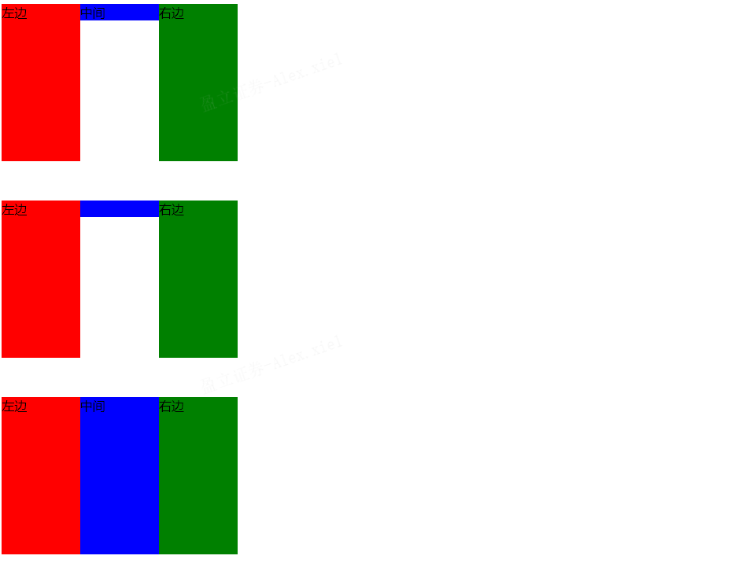

# CSS问题
## 三栏布局
给定两边宽度,中间自适应
### 实现
1. float布局
```HTML
<div class="float">
        <div class="float-left">左边</div>
        <div class="float-right">右边</div>
        <div class="float-center">中间</div>
</div>
```
```CSS
.float {
    width: 300px;
    height: 200px;
}
.float-left {
    float: left;
    width: 100px;
    height: 200px;
    background: red;
}
.float-center {
    background: blue;
}
.float-right {
    float: right;
    width: 100px;
    height: 200px;
    background: green;
}
```

2. position: absolute布局
```HTML
 <div class="position">
        <div class="position-left">左边</div>
        <div class="position-right">右边</div>
        <div class="position-center">中间</div>
</div>
```
```CSS
.position{
    position: relative;
    width: 300px;
    height: 200px;
    padding-top: 50px;
}
.position-left {
    position: absolute;
    left: 0;
    width: 100px;
    height: 200px;
    background: red;
}
.position-center {
    background: blue;
}
.position-right {
    position: absolute;
    right: 0;
    width: 100px;
    height: 200px;
    background: green;
}
```

3. flex布局
```HTML
<div class="flex">
        <div class="flex-left">左边</div>
        <div class="flex-center">中间</div>
        <div class="flex-right">右边</div>
</div>
```
```CSS
.flex {
    display: flex;
    width: 300px;
    height: 200px;
    padding-top: 50px;
}
.flex-left {
    width: 100px;
    height: 200px;
    background: red;
}
.flex-center {
    flex: 1;
    background: blue;
}
.flex-right {
    width: 100px;
    height: 200px;
    background: green;
}
```

4. table布局
```HTML
<div class="table">
        <div class="table-left">左边</div>
        <div class="table-center">中间</div>
        <div class="table-right">右边</div>
</div>
```
```CSS
.table {
    display: table;
    width: 300px;
    height: 200px;
    padding-top: 50px;
}
.table-left {
    display: table-cell;
    width: 100px;
    height: 200px;
    background: red;
}
.table-center {
    display: table-cell;
    background: blue;
}
.table-right {
    display: table-cell;
    width: 100px;
    height: 200px;
    background: green;
}
```

5. grid布局
```HTML
<div class="grid">
        <div class="grid-left">左边</div>
        <div class="grid-center">中间</div>
        <div class="grid-right">右边</div>
</div>
```
```CSS
.grid {
    display: grid;
    grid-template-columns: 100px auto 100px;
    grid-template-rows: 200px;
    width: 300px;
    height: 200px;
    padding-top: 50px;
}
.grid-left {
    background: red;
}
.grid-center {
    background: blue;
}
.grid-right {
    background: green;
}
```

6. 效果图


## 垂直居中
### 实现
```HTML
<div class="container1">
        <div class="inner1">中间</div>
</div>
```
```CSS
.container1 {
    position: relative;
    width: 300px;
    height: 300px;
    background: red;
}

/* absolute + 负margin 需要知道子元素宽高 */
/* .inner1 {
    position: absolute;
    width: 100px;
    height: 100px;
    background: yellow;
    left: 50%;
    top: 50%;
    margin-left: -50px;
    margin-top: -50px;
} */

/* absolute + auto margin 需要知道子元素宽高 */
/* .inner1 {
    position: absolute;
    width: 100px;
    height: 100px;
    background: yellow;
    left: 0;
    top: 0;
    bottom: 0;
    right: 0;
    margin: auto;
} */

/* absolute + calc 需要知道子元素宽高 */
/* .inner1 {
    position: absolute;
    width: 100px;
    height: 100px;
    background: yellow;
    left: calc(50% - 50px);
    top: calc(50% - 50px);
} */

/* absolute + transform 不需要知道子元素宽高 */
/* .inner1 {
    position: absolute;
    background: yellow;
    left: 50%;
    top: 50%;
    transform: translate(-50%, -50%);
} */

/* 使用flex 或者grid实现 略 */
```